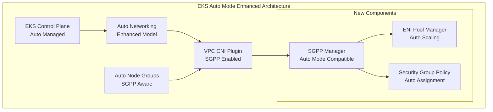

# EKS Auto Mode Security Groups per Pod Enhancement - Design Document

## Executive Summary

This document outlines the design for enhancing Amazon EKS Auto Mode to support Security Groups per Pod (SGPP), addressing the current limitation where Auto Mode does not support fine-grained network security controls at the pod level.

## Problem Statement

### Current Limitation
- EKS Auto Mode does not support Security Groups per Pod (SGPP)
- Users must choose between Auto Mode simplicity and SGPP security granularity
- This limitation is documented in AWS EKS User Guide

### Impact
- Security teams cannot implement pod-level network policies in Auto Mode
- Applications requiring fine-grained network security must use Standard Mode
- Increased operational complexity for security-sensitive workloads

## Solution Architecture

### High-Level Architecture



### Component Design

#### 1. Auto Mode Detection
- **Purpose**: Detect when a cluster is running in Auto Mode
- **Implementation**: Check cluster tags and API responses
- **Location**: `pkg/eniconfig/auto_mode_detector.go`

#### 2. Enhanced ENI Management
- **Purpose**: Manage ENIs for SGPP in Auto Mode
- **Implementation**: Pool-based ENI allocation with security group assignment
- **Location**: `pkg/eniconfig/auto_mode_eni.go`

#### 3. Security Group Assignment
- **Purpose**: Assign security groups to pods in Auto Mode
- **Implementation**: Annotation-based security group specification
- **Location**: `pkg/eniconfig/auto_mode_sg.go`

## Implementation Details

### Phase 1: Core Components
1. Auto Mode Detection Service
2. Enhanced ENI Manager
3. Security Group Manager
4. Configuration Updates

### Phase 2: Integration
1. VPC CNI Plugin Integration
2. EKS Control Plane Integration
3. Testing Framework

### Phase 3: Testing & Validation
1. Unit Tests
2. Integration Tests
3. End-to-End Tests
4. Performance Tests

## Configuration Changes

### Enhanced ConfigMap
```yaml
apiVersion: v1
kind: ConfigMap
metadata:
  name: aws-node
  namespace: kube-system
data:
  ENABLE_POD_ENI: "true"
  POD_SECURITY_GROUP_ENFORCING_MODE: "strict"
  AUTO_MODE_SGPP_ENABLED: "true"
  AUTO_MODE_ENI_POOL_SIZE: "10"
  AUTO_MODE_SG_FALLBACK: "cluster-security-group"
```

## Security Considerations

1. **Network Isolation**: Ensure proper network isolation between pods
2. **Security Group Validation**: Validate security group assignments
3. **Access Control**: Implement proper access controls for SGPP management
4. **Audit Logging**: Log all security group assignments and changes

## Performance Considerations

1. **ENI Pool Management**: Efficient ENI pool allocation and deallocation
2. **Security Group Assignment**: Optimize security group attachment process
3. **Memory Usage**: Minimize memory footprint of new components
4. **Latency**: Ensure minimal impact on pod startup time

## Testing Strategy

### Unit Tests
- Auto Mode Detection
- ENI Management
- Security Group Assignment
- Configuration Validation

### Integration Tests
- VPC CNI Plugin Integration
- EKS Control Plane Integration
- End-to-End Workflows

### Performance Tests
- Pod Startup Time
- ENI Allocation Performance
- Security Group Assignment Performance

## Migration Strategy

### Backward Compatibility
- Maintain existing functionality for Standard Mode
- Gradual rollout of Auto Mode SGPP support
- Fallback mechanisms for unsupported configurations

### Rollout Plan
1. **Alpha Release**: Internal testing with select customers
2. **Beta Release**: Limited public beta with feedback collection
3. **GA Release**: Full production release with documentation

## Success Metrics

1. **Functionality**: SGPP works correctly in Auto Mode
2. **Performance**: No significant performance degradation
3. **Compatibility**: Backward compatibility maintained
4. **Adoption**: Positive user feedback and adoption

## Risks and Mitigation

### Technical Risks
- **ENI Limits**: Mitigate with efficient ENI pool management
- **Security Group Limits**: Implement proper validation and limits
- **Performance Impact**: Optimize critical paths and add monitoring

### Operational Risks
- **Complexity**: Maintain simplicity of Auto Mode
- **Compatibility**: Ensure backward compatibility
- **Documentation**: Provide comprehensive documentation

## Next Steps

1. **Prototype Development**: Create working prototype
2. **Community Engagement**: Engage with AWS team and community
3. **Design Review**: Conduct design review with stakeholders
4. **Implementation**: Begin implementation based on approved design
