# Data Flow Documentation

This document describes the data flow and interactions in the EKS Auto Mode SGPP enhancement.

## 📋 **Data Flow Overview**

The EKS Auto Mode SGPP enhancement implements a comprehensive data flow that handles pod lifecycle, ENI allocation, security group assignment, and resource management.

## 🔄 **Main Data Flow**

### **Pod Creation Flow**

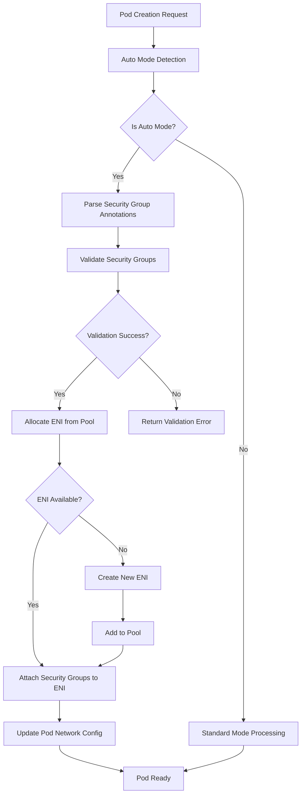

### **Pod Deletion Flow**

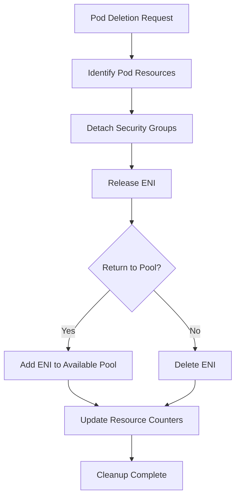

## 📊 **Component Data Flow**

### **Auto Mode Detection Flow**

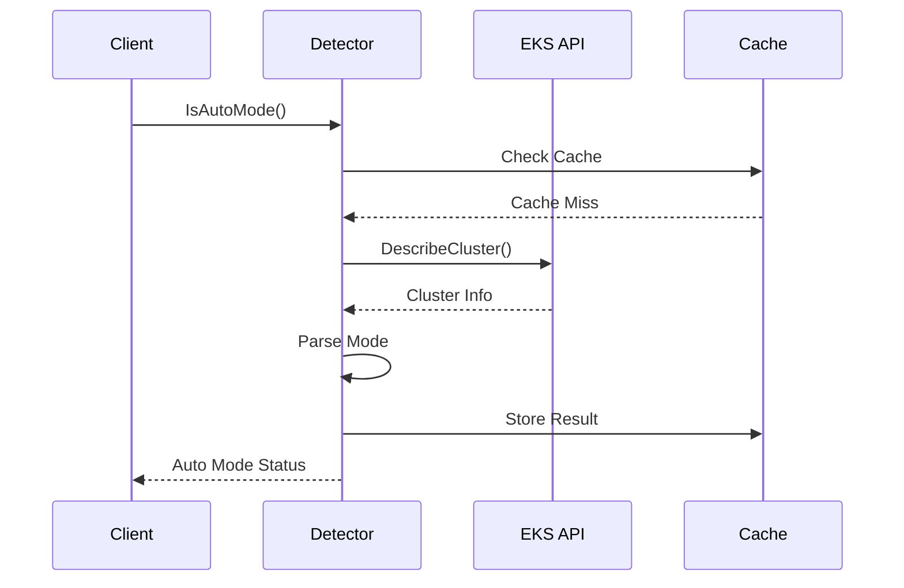

### **ENI Allocation Flow**

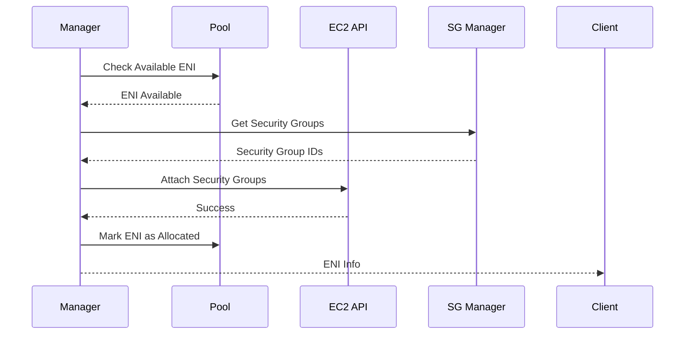

### **Security Group Validation Flow**

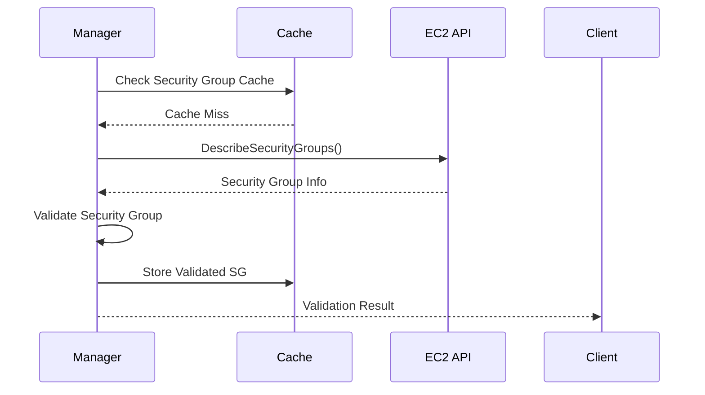

## 🔧 **Data Structures Flow**

### **Pod Specification Flow**

```go
// Pod creation data flow
type PodCreationFlow struct {
    // Input
    PodSpec *PodSpec
    
    // Processing
    SecurityGroups []string
    ENIInfo       *ENIInfo
    NetworkInfo   *PodNetworkInfo
    
    // Output
    Result *PodNetworkInfo
    Error  error
}
```

### **ENI Allocation Flow**

```go
// ENI allocation data flow
type ENIAllocationFlow struct {
    // Input
    PodSpec        *PodSpec
    SecurityGroups []string
    
    // Processing
    PoolCheck      bool
    ENICreation    bool
    SGAttachment   bool
    
    // Output
    ENIInfo *ENIInfo
    Error   error
}
```

## 🔄 **Resource Management Flow**

### **ENI Pool Management**

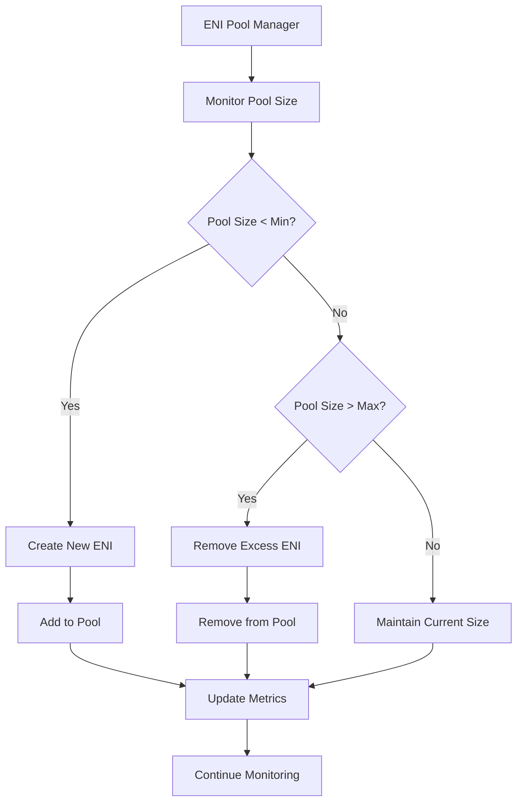

### **Security Group Cache Management**

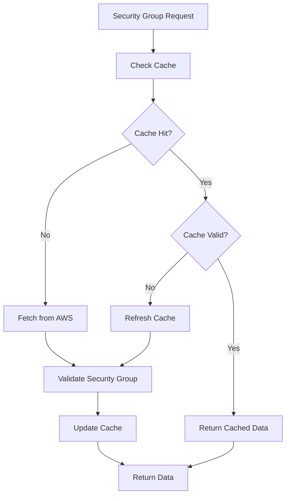

## 📝 **Error Flow Handling**

### **Error Propagation Flow**

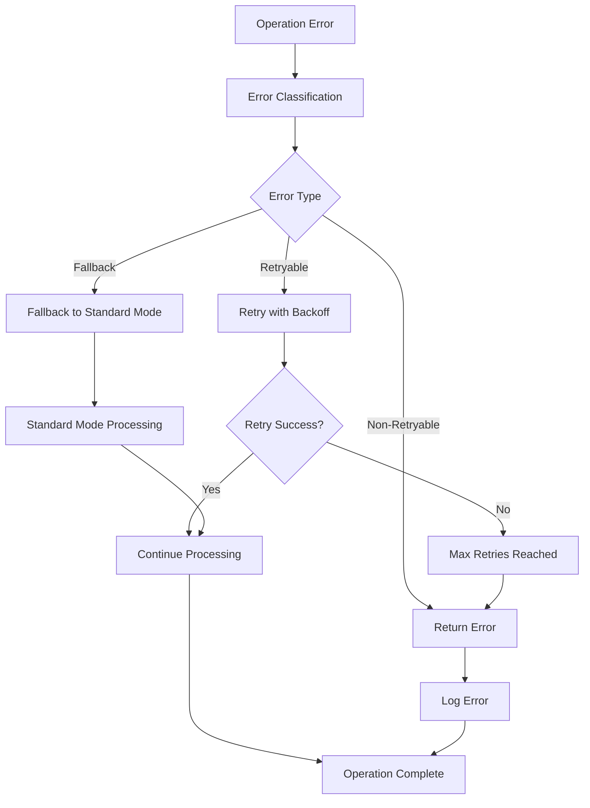

### **Fallback Mechanism Flow**

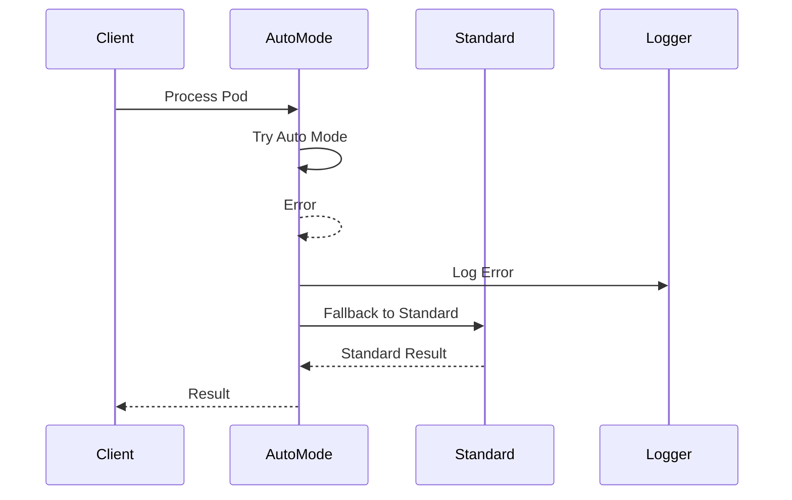

## 🔍 **Monitoring and Metrics Flow**

### **Metrics Collection Flow**

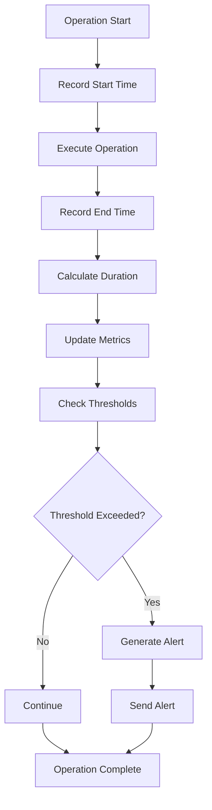

## 📊 **Configuration Flow**

### **Configuration Loading Flow**

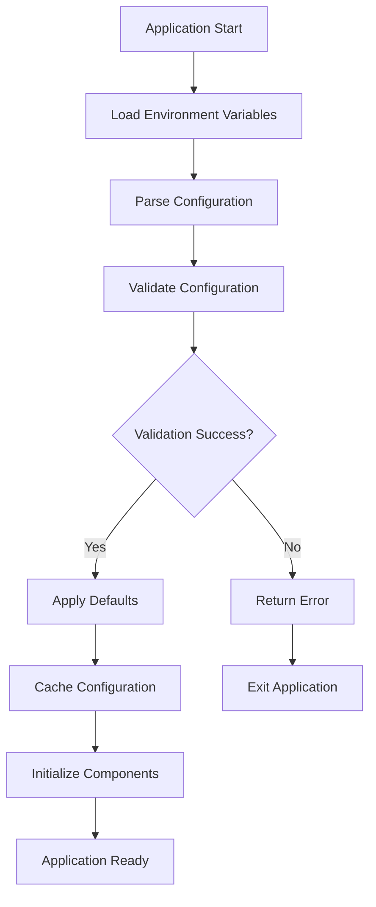

## 🔗 **Integration Flow**

### **IPAM Integration Flow**

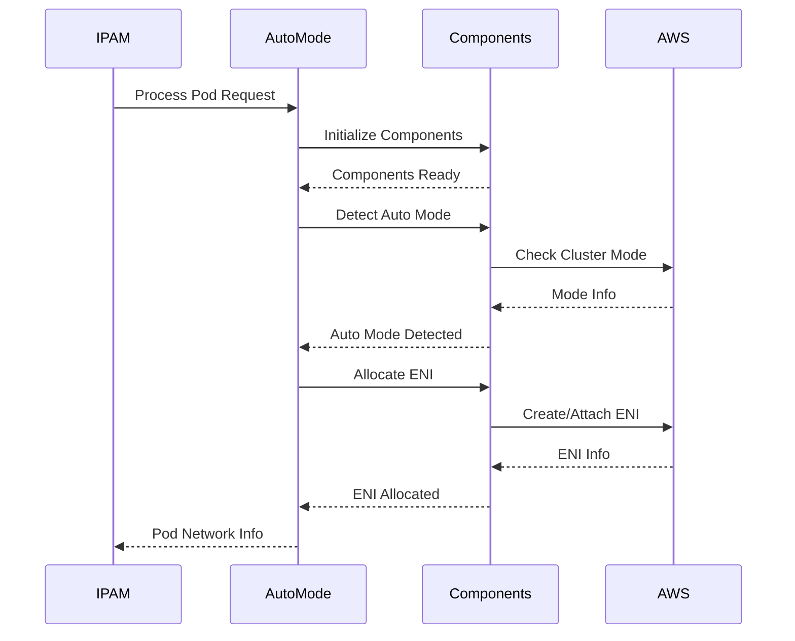

## 🔗 **Related Documentation**

- [Architecture Overview](overview.md)
- [Components](components.md)
- [Auto Mode Detector API](../api/auto-mode-detector.md)
- [ENI Manager API](../api/eni-manager.md)
- [Security Group Manager API](../api/security-group-manager.md)
