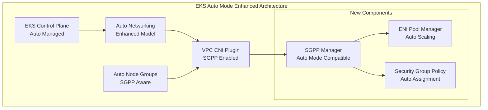
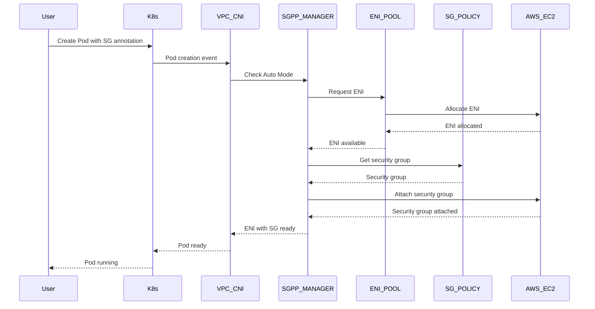
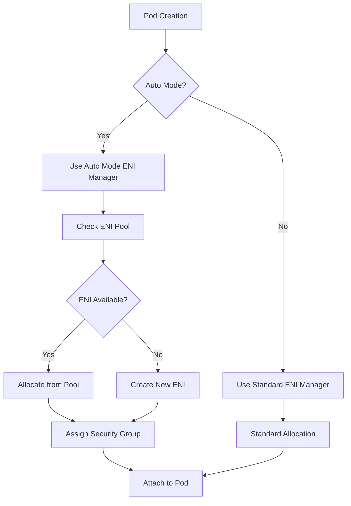
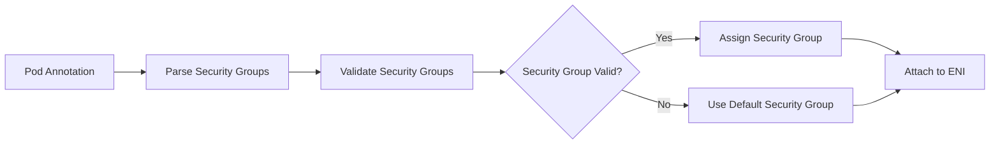
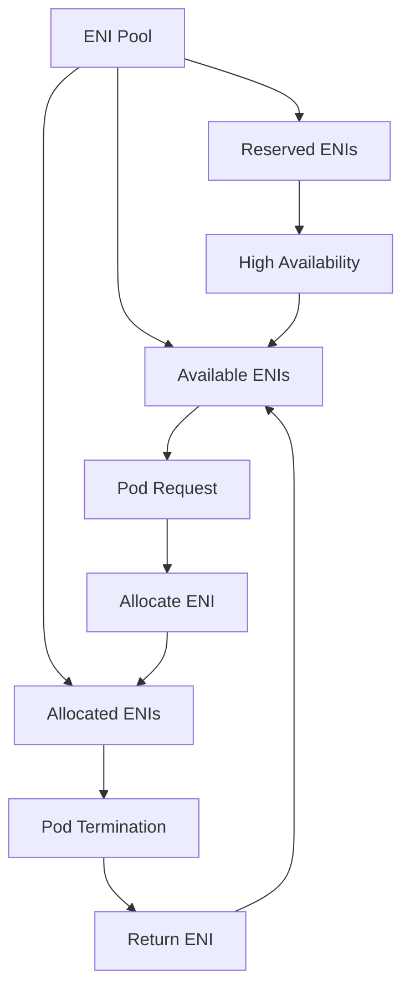
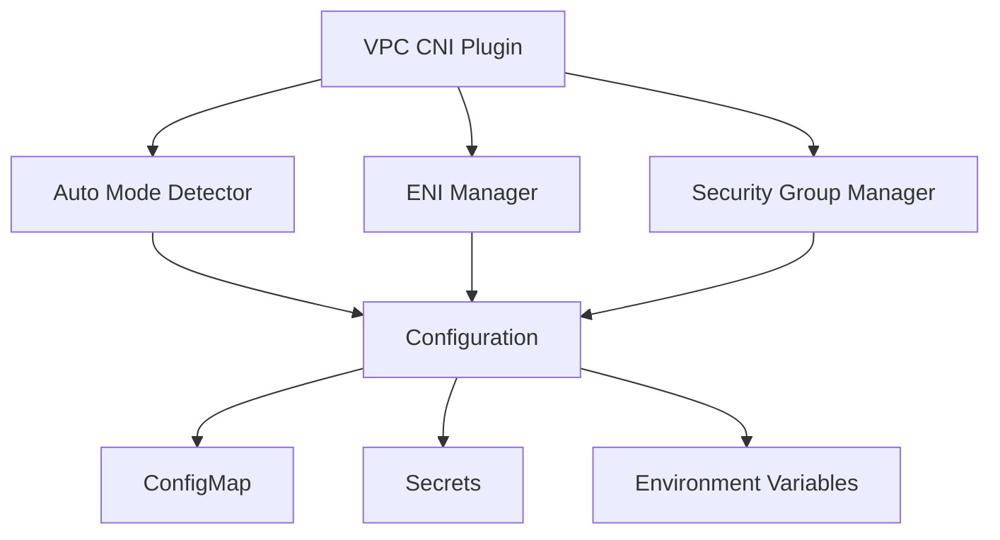

# EKS Auto Mode SGPP Enhancement - Architecture Overview

## System Architecture

The EKS Auto Mode Security Groups per Pod (SGPP) enhancement introduces several new components to support fine-grained network security in Auto Mode clusters.

## High-Level Architecture

## Component Architecture

### 1. Auto Mode Detection Service

**Purpose**: Detect when a cluster is running in Auto Mode

**Key Features**:
- Cluster mode detection via API calls
- Configuration validation
- Fallback mechanisms

**Location**: `pkg/eniconfig/auto_mode_detector.go`

### 2. Enhanced ENI Manager

**Purpose**: Manage ENIs for SGPP in Auto Mode

**Key Features**:
- Pool-based ENI allocation
- Security group assignment
- Auto-scaling ENI pools

**Location**: `pkg/eniconfig/auto_mode_eni.go`

### 3. Security Group Manager

**Purpose**: Assign security groups to pods in Auto Mode

**Key Features**:
- Annotation-based security group specification
- Security group validation
- Fallback to default security groups

**Location**: `pkg/eniconfig/auto_mode_sg.go`

## Data Flow Architecture

### Pod Creation Flow

### ENI Allocation Flow

## Security Architecture

### Security Group Assignment

### Network Isolation

- **Pod-level isolation**: Each pod can have its own security group
- **Namespace isolation**: Security groups can be scoped to namespaces
- **Tenant isolation**: Multi-tenant security group management

## Performance Architecture

### ENI Pool Management

### Caching Strategy

- **Security Group Cache**: Cache security group information
- **ENI Pool Cache**: Cache available ENIs
- **Configuration Cache**: Cache Auto Mode configuration

## Scalability Architecture

### Horizontal Scaling

- **ENI Pool Scaling**: Automatically scale ENI pools based on demand
- **Security Group Scaling**: Support multiple security groups per pod
- **Node Scaling**: Scale nodes to accommodate ENI requirements

### Vertical Scaling

- **Memory Optimization**: Optimize memory usage for ENI management
- **CPU Optimization**: Optimize CPU usage for security group operations
- **Network Optimization**: Optimize network performance

## Monitoring Architecture

### Metrics Collection

- **ENI Metrics**: ENI allocation and deallocation metrics
- **Security Group Metrics**: Security group assignment metrics
- **Performance Metrics**: Performance and latency metrics

### Logging

- **Structured Logging**: JSON-formatted logs
- **Log Levels**: Debug, Info, Warn, Error
- **Log Aggregation**: Centralized log collection

## Deployment Architecture

### Component Deployment

### Configuration Management

- **ConfigMap**: Configuration for Auto Mode components
- **Secrets**: Sensitive configuration data
- **Environment Variables**: Runtime configuration

## Error Handling Architecture

### Error Types

- **Configuration Errors**: Invalid configuration
- **API Errors**: AWS API errors
- **Network Errors**: Network connectivity issues
- **Resource Errors**: Resource allocation failures

### Error Recovery

- **Retry Logic**: Automatic retry for transient errors
- **Fallback Mechanisms**: Fallback to default configurations
- **Circuit Breakers**: Prevent cascading failures

## Future Architecture Considerations

### Planned Enhancements

- **Multi-Region Support**: Support for multi-region deployments
- **Advanced Security**: Enhanced security features
- **Performance Optimization**: Further performance improvements

### Scalability Improvements

- **Distributed ENI Management**: Distributed ENI pool management
- **Advanced Caching**: More sophisticated caching strategies
- **Load Balancing**: Load balancing for ENI allocation
